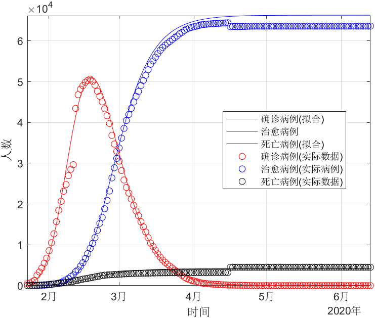
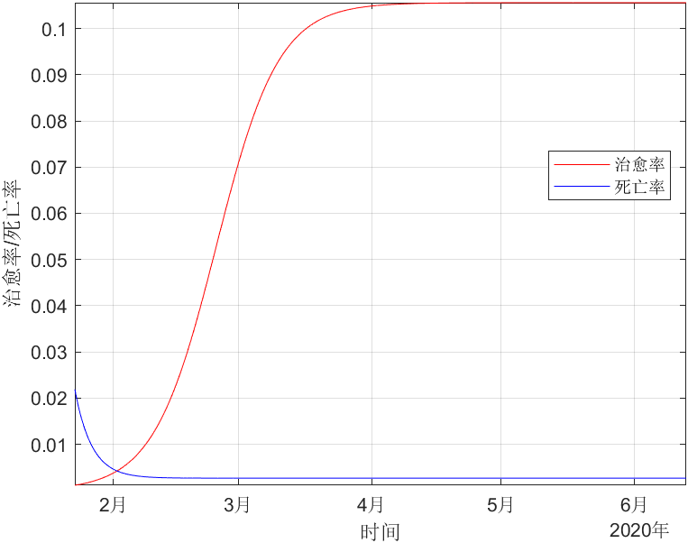
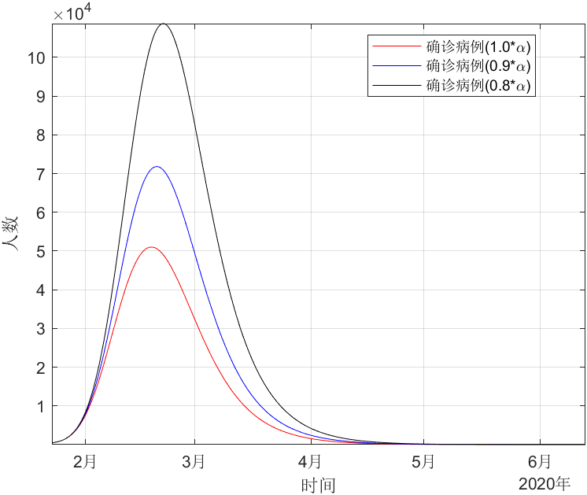
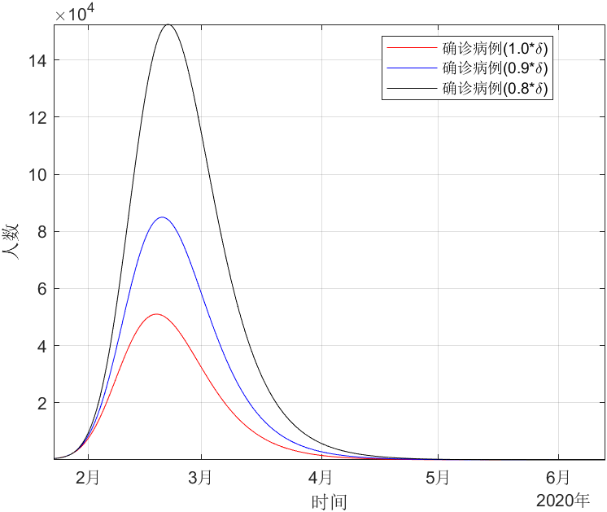

# COVID-19 SEIR Epidemic Model

This project is a part of my coursework, which consists of the generalized SEIR model, dataset and analysis code. Most of code in this project is based on Ref [1]. The SEIR model is proposed in Ref [2].

## File Structure

`data`  
&emsp;| - HuBei.csv                           filtered dataset  
&emsp;| - 湖北省新冠疫情统计数据(原版).xlsx       unfiltered dataset  
`SEIQRDP.m`                                 used to simulate the time histories of the infectious, recovered and dead cases (among others)  
`fit_SEIQRDP.m`                             estimating the ten parameters used in SEIQRDP.m in the least square sense  
`HuBei.mlx`                                 HuBei province
`cure_and_dead.mlx`                         how cure rate and dead rate is changing in epidemic development   
`protection_rate.mlx`                       the importance of protection_rate
`quarantine_rate.mlx`                       the importance of quarantine_rate

## Example

### Example 1

The example 1 is used to estimate parameters of SEIR model, and then fit real data, whose file is named `HuBei.mlx`

The results is following:

### Example 2

The example 2 is used to show the changing of cure rate and dead rate in `cure_and_dead.mlx`

The results is following:

### Example 3

The example 3 is used to show the importance of protection rate and quarantine rate in `protection_rate.mlx` and `quarantine_rate.mlx`

The results is following: 

## Ref
[1] https://github.com/ECheynet/SEIR  
[2] https://arxiv.org/abs/2002.06563
